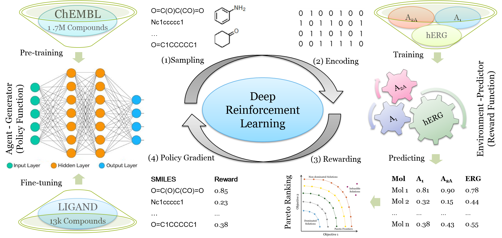

DrugEx
====================
This repository contains further developments by Gerard van Westen's Computational Drug Discovery group to **Drug Explorer (DrugEx)**, a _de novo_ drug design tool based on deep learning, originally developed by [Xuhan Liu](https://github.com/XuhanLiu/DrugEx/) & Gerard J.P. van Westen. [2,3,4]

Please see the LICENSE file for the license terms for the software. Basically it's free to academic users. If you do wish to sell the software or use it in a commercial product, then please contact us:

   [Xuhan Liu](mailto:xuhanliu@hotmail.com) (First Author): xuhanliu@hotmail.com 

   [Gerard J.P. van Westen](mailto:gerard@lacdr.leidenuniv.nl) (Correspondent Author): gerard@lacdr.leidenuniv.nl 
   
Quick Start
===========

> A small step for exploring the drug space in need, a giant leap for exploiting a healthy state indeed.


### Installation

DrugEx can be installed with pip like so:

```bash
pip install git+https://github.com/CDDLeiden/DrugEx.git@master
```

#### Optional Dependencies

**[QSPRPred](https://github.com/CDDLeiden/QSPRPred.git)** - Optional package to install if you want to use the command line interface of DrugEx, which requires the models to be serialized with this package. It is also used by some examples in the tutorial.

**[RAscore](https://github.com/reymond-group/RAscore)** - If you want to use the Retrosynthesis Accessibility Score in the desirability function.
- The installation of RAscore might downgrade the scikit-Learn packages. If this happens, scikit-Learn should be re-upgraded.


### Use

After installation, you will have access to various command line features, but you can also use the Python API directly. Documentation for the current version of both is available [here](https://cddleiden.github.io/DrugEx/docs/). For a quick start, you can also check out our [Jupyter notebook tutorial](./tutorial), which documents the use of the Python API to build different types of models. The tutorial as well as the documentation are still work in progress, and we will be happy for any contributions where it is still lacking.

This repository contains almost all models implemented throughout DrugEx history. We also make the following pretrained models available to be used with this package. You can retrieve them from the following table (not all models are available at this moment, but we will keep adding them):

| Model / Training Set 	   | [DrugEx (v2)](https://doi.org/10.1186/s13321-021-00561-9)	 | [DrugEx (v3), SMILES-Based Transformer](https://doi.org/10.26434/chemrxiv-2021-px6kz)	 | [DrugEx (v3), Graph-Based Transformer](https://doi.org/10.26434/chemrxiv-2021-px6kz)	     |
|--------------------------|------------------------------------------------------------|----------------------------------------------------------------------------------------|-------------------------------------------------------------------------------------------|
| 	     ChEMBL 27          | 	     [Zenodo](https://doi.org/10.5281/zenodo.7096837)                     | 	       NA                                                                             | 	         [Zenodo](https://doi.org/10.5281/zenodo.7096823)                                                |
| 	        ChEMBL 31       | 	               [Zenodo](https://doi.org/10.5281/zenodo.7378916)           | 	                                                      NA                              | 	                                                        [Zenodo](https://doi.org/10.5281/zenodo.7085629) |
| 	       [Papyrus 05.5](https://doi.org/10.26434/chemrxiv-2021-1rxhk) | 	          [Zenodo](https://doi.org/10.5281/zenodo.7378923)                                      | 	                             NA                                                       | 	       [Zenodo](https://doi.org/10.5281/zenodo.7085421)                                                                        |

You will find more information about the history of the project and the newest models below.

Introduction
=============

<p align=left width=70%>Due to the large drug-like chemical space available to search for feasible drug-like molecules, rational drug design often starts from specific scaffolds to which side chains/substituents are added or modified. With the rapid growth of the application of deep learning in drug discovery, a variety of effective approaches have been developed for de novo drug design. In previous work, we proposed a method named DrugEx, which can be applied in polypharmacology based on multi-objective deep reinforcement learning. However, the previous version is trained under fixed objectives similar to other known methods and does not allow users to input any prior information (i.e. a desired scaffold). In order to improve the general applicability, we updated DrugEx to design drug molecules based on scaffolds which consist of multiple fragments provided by users. In this work, the Transformer model was employed to generate molecular structures. The Transformer is a multi-head self-attention deep learning model containing an encoder to receive scaffolds as input and a decoder to generate molecules as output. In order to deal with the graph representation of molecules we proposed a novel positional encoding for each atom and bond based on an adjacency matrix to extend the architecture of the Transformer. Each molecule was generated by growing and connecting procedures for the fragments in the given scaffold that were unified into one model. Moreover, we trained this generator under a reinforcement learning framework to increase the number of desired ligands. As a proof of concept, our proposed method was applied to design ligands for the adenosine A2A receptor (A2AAR) and compared with SMILES-based methods. The results demonstrated the effectiveness of our method in that 100% of the generated molecules are valid and most of them had a high predicted affinity value towards A2AAR with given scaffolds. 

<b>Keywords</b>: deep learning, reinforcement learning, policy gradient, drug design, Transformer, multi-objective optimization</p>

Workflow
========


Deep learning Archietectures
====================


Examples
=========


Current Development Team
========================
- S. Luukkonen
- M. Sicho
- H. van den Maagdenberg
- L. Schoenmaker

Acknowledgements
================

We would like to thank the following people for significant contributions:

- Xuhan Liu
  - author of the original idea to develop the DrugEx models and code, we are happy for his continuous support of the project
- Olivier Béquignon
  - testing code and pretraining many of the available models

We also thank the following Git repositories that gave Xuhan a lot of inspirations:
   
1. [REINVENT](https://github.com/MarcusOlivecrona/REINVENT)
2. [ORGAN](https://github.com/gablg1/ORGAN)
3. [SeqGAN](https://github.com/LantaoYu/SeqGAN)

References
==========

1. [Liu X, IJzerman AP, van Westen GJP. Computational Approaches for De Novo Drug Design: Past, Present, and Future. Methods Mol Biol. 2021;2190:139-65.](https://link.springer.com/protocol/10.1007%2F978-1-0716-0826-5_6)

2. [Liu X, Ye K, van Vlijmen HWT, IJzerman AP, van Westen GJP. DrugEx v3: Scaffold-Constrained Drug Design with Graph Transformer-based Reinforcement Learning. Preprint](https://chemrxiv.org/engage/chemrxiv/article-details/61aa8b58bc299c0b30887f80)

3. [Liu X, Ye K, van Vlijmen HWT, Emmerich MTM, IJzerman AP, van Westen GJP. DrugEx v2: De Novo Design of Drug Molecule by Pareto-based Multi-Objective Reinforcement Learning in Polypharmacology. Journal of cheminformatics 2021:13(1):85.](https://doi.org/10.1186/s13321-021-00561-9) 

4. [Liu X, Ye K, van Vlijmen HWT, IJzerman AP, van Westen GJP. An exploration strategy improves the diversity of de novo ligands using deep reinforcement learning: a case for the adenosine A2A receptor. Journal of cheminformatics. 2019;11(1):35.](https://jcheminf.biomedcentral.com/articles/10.1186/s13321-019-0355-6)

