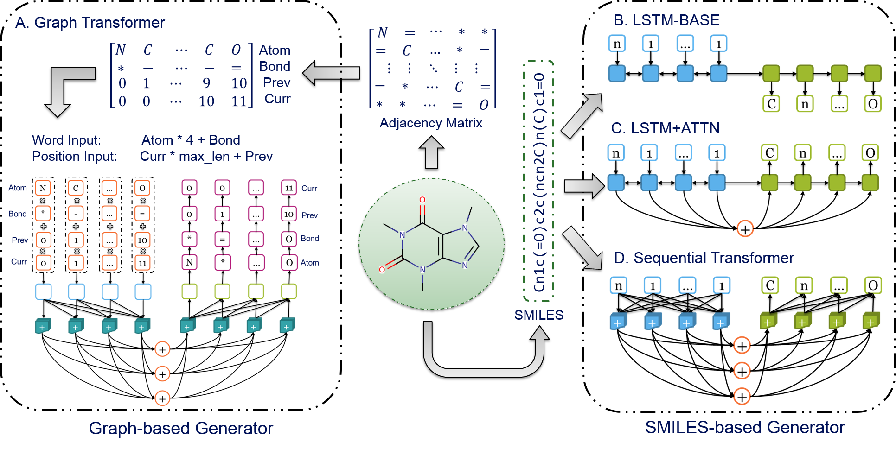

DrugEx
====================
This repository contains developements by Gerard van Westen's Computational Drug Discovery group to **Drug Explorer (DrugEx)**, a _de novo_ drug design model, originally developped by [Xuhan Liu](https://github.com/XuhanLiu/DrugEx/) & Gerard J.P. van Westen. [2,3,4]

Please see the LICENSE file for the license terms for the software. Basically it's free to academic users. If you do wish to sell the software or use it in a commercial product, then please contact us:

   [Xuhan Liu](mailto:xuhanliu@hotmail.com) (First Author): xuhanliu@hotmail.com 

   [Gerard J.P. van Westen](mailto:gerard@lacdr.leidenuniv.nl) (Correspondent Author): gerard@lacdr.leidenuniv.nl 
   
Quick Start
===========

> A small step for exploring the drug space in need, a giant leap for exploiting a healthy state indeed.

DrugEx is now installable by pip and you can easily install the latest release of the package like so:

```bash
pip install git+https://github.com/CDDLeiden/DrugEx.git@master
```

After installation, you will have access to various command line features, but you can also use the Python API directly. Documentation for the current version is available [here](https://cddleiden.github.io/DrugEx/docs/). But you can also check out the [Jupyter notebook tutorial](./tutorial) in this repository, which documents the use of the Python API to build different types of models. The tutorial as well as the documentation are still work in progress so feel free to contribute to it if you find spots where it is lacking. You will find more information about the history of the project and the models you can build below.

Introduction
=============

<p align=left width=70%>Due to the large drug-like chemical space available to search for feasible drug-like molecules, rational drug design often starts from specific scaffolds to which side chains/substituents are added or modified. With the rapid growth of the application of deep learning in drug discovery, a variety of effective approaches have been developed for de novo drug design. In previous work, we proposed a method named DrugEx, which can be applied in polypharmacology based on multi-objective deep reinforcement learning. However, the previous version is trained under fixed objectives similar to other known methods and does not allow users to input any prior information (i.e. a desired scaffold). In order to improve the general applicability, we updated DrugEx to design drug molecules based on scaffolds which consist of multiple fragments provided by users. In this work, the Transformer model was employed to generate molecular structures. The Transformer is a multi-head self-attention deep learning model containing an encoder to receive scaffolds as input and a decoder to generate molecules as output. In order to deal with the graph representation of molecules we proposed a novel positional encoding for each atom and bond based on an adjacency matrix to extend the architecture of the Transformer. Each molecule was generated by growing and connecting procedures for the fragments in the given scaffold that were unified into one model. Moreover, we trained this generator under a reinforcement learning framework to increase the number of desired ligands. As a proof of concept, our proposed method was applied to design ligands for the adenosine A2A receptor (A2AAR) and compared with SMILES-based methods. The results demonstrated the effectiveness of our method in that 100% of the generated molecules are valid and most of them had a high predicted affinity value towards A2AAR with given scaffolds. 

<b>Keywords</b>: deep learning, reinforcement learning, policy gradient, drug design, Transformer, multi-objective optimization</p>

Workflow
========


Deep learning Archietectures
====================


Examples
=========


Dependencies
============
Firstly, ensure that the version of your Python >= 3.7. 
We recommend Anaconda to manage the version of Python and installed packages.

Secondly, all the following packages are installed in your machine:

**1. [Numpy](https://numpy.org/)** (version >= 1.19)

        $ conda install numpy

**2. [Scikit-Learn](https://scikit-learn.org/stable/)** (version >= 1.0.2)

        $ conda install scikit-learn

**3. [Pandas](https://pandas.pydata.org/)** (version >= 1.2.2)

        $ conda install pandas

**4. [PyTorch](https://PyTorch.org/)**  (version == 1.7)

        $ conda install pytorch torchvision cudatoolkit=x.x -c pytorch 
    
        Note: it depends on the GPU device and CUDA tookit 
              (x.x is the version of CUDA)

**5. [Matplotlib](https://matplotlib.org/)** (version >= 2.0)

        $ conda install matplotlib
   
**6. [RDKit](https://www.rdkit.org/)** (version >= 2020.03)

        $ conda install -c rdkit rdkit

**7. [Xgboost](https://xgboost.readthedocs.io/en/stable/)**

        $ conda install -c conda-forge xgboost

**8. [tqdm](https://github.com/tqdm/tqdm#latest-conda-release)**
    
        $ conda install -c conda-forge tqdm

**9. [gitpython](https://gitpython.readthedocs.io/en/stable/)**

        $ conda install -c conda-forge gitpython

**10. (opt) [RAscore](https://github.com/reymond-group/RAscore)** if you want to use the Retrosynthesis Accessibility Score in the desirability function
- The installation of RAscore might degrade the Scikit-Learn packages. If this happens, Scikit-Learn should be re-upgraded.

Usage
======
For designing the novel drug molecules with SMILES- or graph-based representation, you should do the following steps sequentially by running scripts:

0. Create `$BASE_DIR` folder 
    -  create `$BASE_DIR/data` folder
        - for graph-based representation copy `data/voc_graph.txt` to `$BASE_DIR/data`
        - (opt) for SMILES-based representation copy `data/voc_smiles.txt` to `$BASE_DIR/data` 
            - can also be generated by dataset.py during preparation of pretraining data to ensure that there are no missing tokens
        - (opt) include file with molecules for pre-training (_eg._ all molecules in ChEMBL)
        - include your "ligand" file containing molecules for fine-tuning and reinforcement learning
    - (opt) create `$BASE_DIR/generators` folders and copy a pre-trained model from `pretrained_models` to it

1. dataset.py:
    - (opt) generate vocabulary for the generators
    - (opt) prepare encoded input files for pre-training
    - prepare encode input files for fine-tuning and reinforcement learning

    Generates files to `$BASE_DIR/data`
    - *\_corpus.txt : input file for v2 generators 
    - *\_[train/test]_[smi/graph].txt : train and test input files for v3 SMILES- and graph-based generators 

2. environ.py:
    - (opt) evaluate the performance of the predictors through n-fold cross-validation and independent test set evaluation
    - (opt) optimize predictors' hyperparameters
    - train your predictor as the environment used to provide the reward for the action from the agent during the reinforcement learning

    Generates files to `$BASE_DIR/envs`
    - [model_type]\_[REG/CLS]_[target].cv.tsv : cross-validation results
    - [model_type]\_[REG/CLS]_[target].ind.tsv : independant test set results
    - [model_type]\_[REG/CLS]_[target].pkg : saved model

3. train.py:
    - (opt) pre-train the generator
    - fine-tune the generator on your "ligand" set
    - optimize generator via reinforcement learning

    Generates files to `$BASE_DIR/generators`

    **!!! WARNING !!!**: Currently only the graph-transformer-based generator is working ! We are working on including both Xuhan's v2. and v3. SMILES-based generators into this repository.

4. designer.py:
    - generate molecules with a well-trained deep learning model with either graph or SMILES representations

    Generates files to `$BASE_DIR/new_molecules`

In addition, this toolkit also provides some other scripts for definition of special data structures, model architectures and coefficient measurements, etc.

1. models/*.py:

    It contains all of the deep learning models that possibly used in this project, including single/multiple 
    fully-connected regression/classification models, RNN generative model and highway CNN classification model.

2. utils/vocab.py: 

    It defines some special data structures, such as vocabulary of SMILES tokens and elements in the graph, molecule dataset, environment 
    and some methods for SMILES and graph checking. 
    The statistical methods that extracting properties from generated molecules.

3. utils/metric.py:

    The statistical methods that extracting properties from generated molecules.

4. utils/fingerprints.py:

    There are a variety of chemical fingerprints calculations, such as ECFP, MACCS etc.

5. utils/modifier.py

    It provides a variety of desirability function to normalize the scoring furntions. 
    For more details, please check [GuacaMol](https://pubs.acs.org/doi/10.1021/acs.jcim.8b00839) benchemark.

6. utils/objective.py

    It provides the construction of different scoring functions, including similary score,
    chemical properties, QSAR modelling, etc. Moreoever, it can also integrate multiple 
    objective into an environment to calculate reward for the agent. 

7. utils/nsgaii.py

    The implementation of non-dominate sorting and crowding distance algorithm (NSGAII). 
    Importantly, we employ PyTorch to accelerate its performance and also modify the
    calculation of crowding distance with Tanimoto-distance.

8. utils/sacorer.py  
  
    The implementation of SA score to measure the synthezability score of each molecule.
    More details about SA score can be found [here](https://jcheminf.biomedcentral.com/articles/10.1186/1758-2946-1-8)


Current development team
========================
- S. Luukkonen
- H. van den Maagdenberg
- L. Schoenmaker

References
==========

1. [Liu X, IJzerman AP, van Westen GJP. Computational Approaches for De Novo Drug Design: Past, Present, and Future. Methods Mol Biol. 2021;2190:139-65.](https://link.springer.com/protocol/10.1007%2F978-1-0716-0826-5_6)

2. [Liu X, Ye K, van Vlijmen HWT, IJzerman AP, van Westen GJP. DrugEx v3: Scaffold-Constrained Drug Design with Graph Transformer-based Reinforcement Learning. Preprint](https://chemrxiv.org/engage/chemrxiv/article-details/61aa8b58bc299c0b30887f80)

3. [Liu X, Ye K, van Vlijmen HWT, Emmerich MTM, IJzerman AP, van Westen GJP. DrugEx v2: De Novo Design of Drug Molecule by Pareto-based Multi-Objective Reinforcement Learning in Polypharmacology. Journal of cheminformatics 2021:13(1):85.](https://doi.org/10.1186/s13321-021-00561-9) 

4. [Liu X, Ye K, van Vlijmen HWT, IJzerman AP, van Westen GJP. An exploration strategy improves the diversity of de novo ligands using deep reinforcement learning: a case for the adenosine A2A receptor. Journal of cheminformatics. 2019;11(1):35.](https://jcheminf.biomedcentral.com/articles/10.1186/s13321-019-0355-6)

Acknowledgement
===============
We thank the following Git repositories that gave Xuhan a lot of inspirations:
   
1. [REINVENT](https://github.com/MarcusOlivecrona/REINVENT)
2. [ORGAN](https://github.com/gablg1/ORGAN)
3. [SeqGAN](https://github.com/LantaoYu/SeqGAN)

